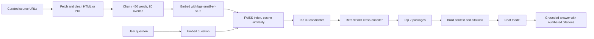
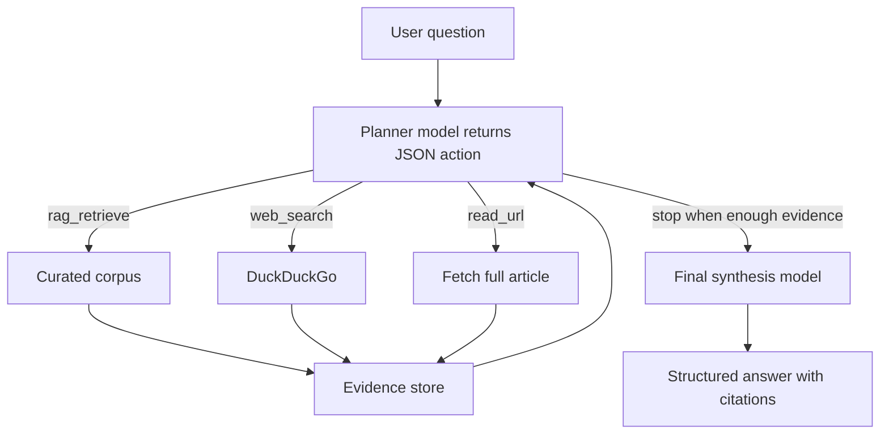
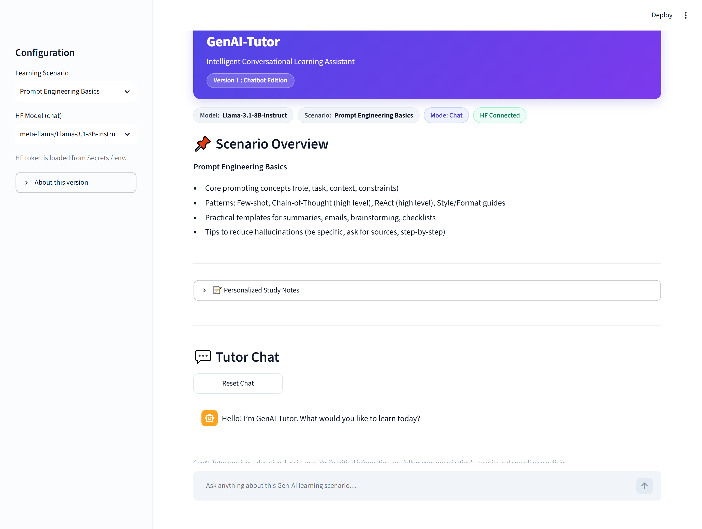
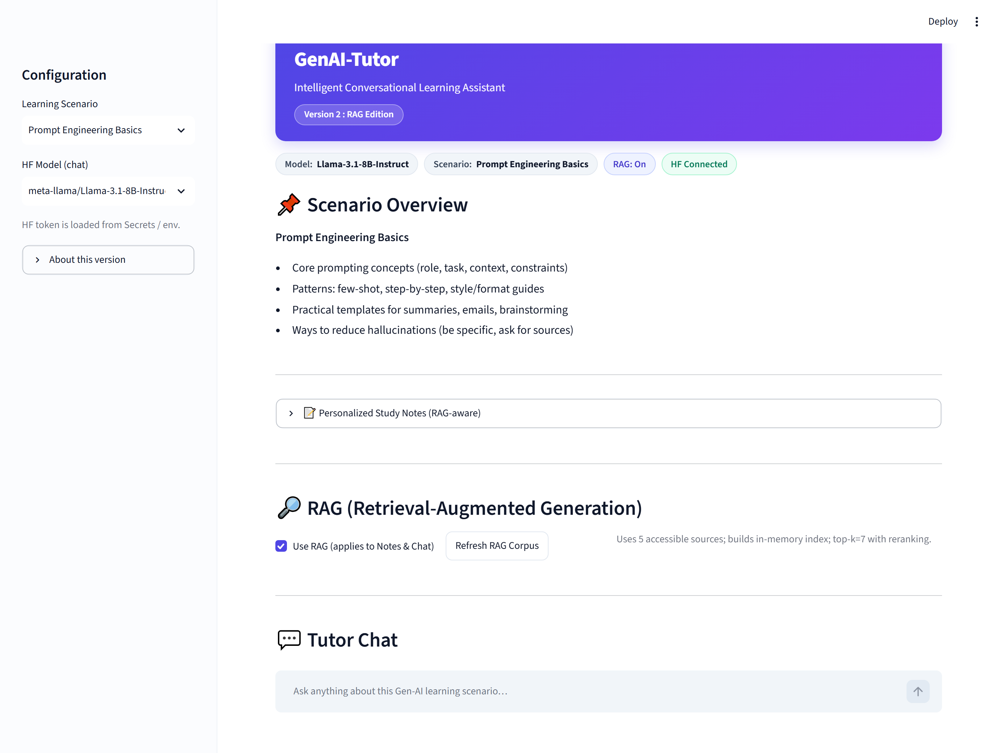
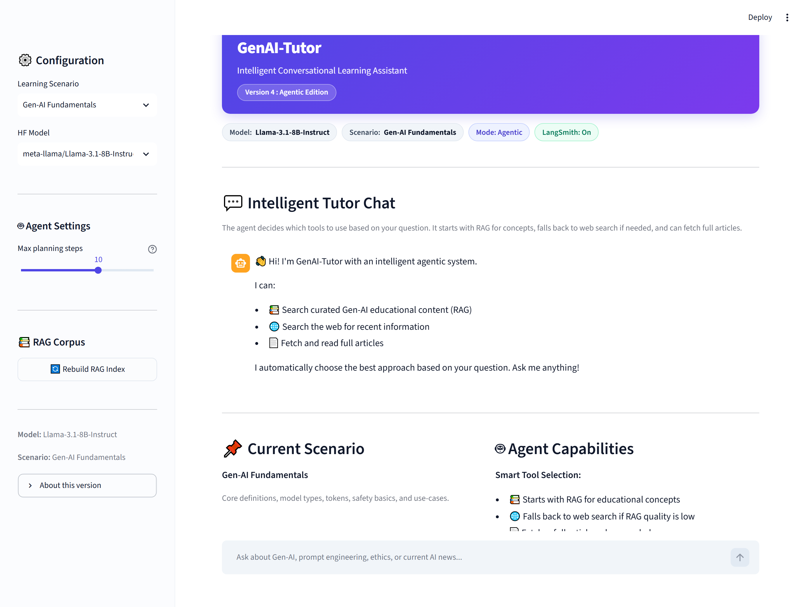

# GenAI-Tutor: Project Document

A study of how one learning assistant evolves across four stages, from a plain
chatbot to a grounded, observable, and finally agentic system.

| Field | Value |
|---|---|
| Project | GenAI-Tutor (Intelligent Conversational Learning Assistant) |
| Author | Pritam Das |
| Repository | github.com/PritamDas96/Tutor_AI |
| Editions | 4 (Chatbot, RAG, RAG + Observability, Agentic) |
| Interface | Streamlit web app |
| Models | Open-source LLMs via Hugging Face Inference |

---

## 1. Executive Summary

GenAI-Tutor is an educational assistant that helps employees learn to use
Generative AI at work. The same product is built four times, each version adding
one clear capability on top of the previous one. Read together, the four apps
tell a simple story about how a modern LLM application matures:

1. Version 1 answers from the model's own memory.
2. Version 2 grounds answers in a curated document corpus and cites sources.
3. Version 3 adds tracing and automatic quality scoring on top of that grounding.
4. Version 4 lets the model plan, choose its own tools, and gather evidence before answering.

This document explains each stage in simple language, shows the main code that
makes it work, and demonstrates the difference with one question asked to all
four versions.

---

## 2. Problem and Objectives

A plain chatbot is easy to build but has two weaknesses for workplace learning:

- It can state things that are not correct, with no sources to check.
- It cannot reach information outside the model's training data.

The objective of this project is to show, step by step, how those weaknesses are
removed. Each edition targets one specific gap:

| Gap in the previous version | Edition that fixes it | How |
|---|---|---|
| No grounding, no sources | Version 2 (RAG) | Retrieve from a curated corpus and cite it |
| No way to measure quality | Version 3 (Observability) | Trace every step and score answers |
| Fixed pipeline, no live data | Version 4 (Agentic) | Let the model plan and use tools including web search |

---

## 3. System at a Glance

| Edition | File | Core capability | When to use |
|---|---|---|---|
| Version 1: Chatbot | TUtor_AI.py | Chat plus curated study notes | Fast, lightweight tutoring |
| Version 2: RAG | Tutor_AI_RAG.py | Grounded answers with citations | Accuracy from a trusted corpus |
| Version 3: RAG plus Observability | Tutor_AI-RAG-Langsmith.py | Tracing and evaluation | Measuring and monitoring quality |
| Version 4: Agentic | Tutor_AI_AGENTIC.py | Planner with tools and web search | Dynamic, up-to-date answers |

All four share the same layout: a sidebar with two dropdowns (Learning Scenario
and Model), a scenario overview, a personalized study-notes panel, and a chat.

---

## 4. Architecture Overview

The retrieval pipeline used by Versions 2, 3, and 4:



The agent loop used by Version 4:



---

## 5. Technology Stack

| Layer | Choice |
|---|---|
| App framework | Streamlit |
| Language model access | Hugging Face InferenceClient |
| Embeddings | sentence-transformers, bge-small-en-v1.5 |
| Reranker | cross-encoder ms-marco-MiniLM-L-6-v2 |
| Vector index | FAISS IndexFlatIP, with a NumPy fallback |
| Parsing | BeautifulSoup for HTML, pypdf for PDF |
| Web search (v4) | LangChain community with DuckDuckGo |
| Tracing (v3, v4) | LangSmith |
| Evaluation (v3) | RAGAS with a Hugging Face judge |

---

## 6. The Four Editions

### 6.1 Version 1: Chatbot

Purpose: a direct conversational tutor plus a study-notes generator. There is no
retrieval, so answers come from the model's own knowledge.

How it works: the app keeps a running list of messages and sends the whole list
to the model on every turn. A small wrapper tries the default provider first and
then a specific provider if the first attempt fails.

```python
def call_hf_chat(model, messages, token, max_new_tokens=512, temperature=0.7, top_p=0.9):
    for provider in (None, "hf-inference"):        # try default routing, then a pinned provider
        try:
            client = InferenceClient(model=model, token=token, provider=provider)
            resp = client.chat_completion(
                messages=messages, max_tokens=int(max_new_tokens),
                temperature=float(temperature), top_p=float(top_p),
            )
            choice = resp.choices[0]
            msg = getattr(choice, "message", None) or choice["message"]
            content = getattr(msg, "content", None) or msg["content"]
            return (content or "").strip()
        except Exception as e:
            last_err = e; time.sleep(0.2)
    raise RuntimeError(f"Chat completion failed for {model}: {last_err}")
```

In plain terms: send the conversation to the model, read back the reply, and be
tolerant of small differences in how the library returns data.

Screenshot:



### 6.2 Version 2: RAG

Purpose: answer from a curated set of documents and cite them, so claims can be
checked.

How it works: the app downloads a small set of trusted articles, splits them into
overlapping chunks, converts each chunk into a vector, and stores the vectors in
a FAISS index. For a question, it finds the closest chunks, reranks them with a
more accurate model, and passes the best passages to the chat model with strict
instructions to use only that context.

Two-stage retrieval is the key idea. A fast search finds many candidates, then a
slower and more accurate reranker keeps only the best ones.

```python
def retrieve(query, index, side, top_k=7, k_candidates=30):
    embedder, reranker = load_embedder(), load_reranker()
    qv = embed_texts([query], embedder)
    scores, idx = index.search(qv, k_candidates)          # stage 1: fast recall (30 candidates)
    candidates = [{"score_ann": float(s), **side["chunks"][ci]}
                  for ci, s in zip(idx[0], scores[0]) if ci >= 0]
    pairs = [(query, c["text"]) for c in candidates]
    rerank_scores = reranker.predict(pairs)               # stage 2: accurate reranking
    for c, rs in zip(candidates, rerank_scores):
        c["score_rerank"] = float(rs)
    candidates.sort(key=lambda x: x["score_rerank"], reverse=True)
    return candidates[:top_k]                             # keep the best 7
```

The model is then told, clearly, how to behave:

```python
def rag_rules():
    return ("Use ONLY the provided CONTEXT. Cite like [1], [2] after claims tied to evidence. "
            "If context is insufficient, say so and suggest which source to read. Do NOT invent URLs. "
            "End with a 'Sources' list mapping [n] to URL.")
```

In plain terms: find the most relevant passages, hand them to the model, and
require it to cite them and not to make up links.

Screenshot:



### 6.3 Version 3: RAG plus Observability

Purpose: keep the grounded answers of Version 2, and add the ability to see and
measure what the system is doing.

How it works: functions are wrapped so that every retrieval and every model call
is recorded as a trace in LangSmith. Users can rate answers with a thumbs up or
down, and a panel runs RAGAS to score recent answers for faithfulness (is the
answer supported by the sources) and answer relevancy (does it address the
question). The judge for these scores is itself an open-source model, so no
external paid service is required.

```python
@traceable(run_type="llm", name="hf_chat")
def call_hf_chat(model, messages, token, ...):
    ...

scores = evaluate(
    dataset=ds,
    metrics=[Faithfulness(), AnswerRelevancy()],
    llm=judge,          # a Hugging Face model acts as the judge
    embeddings=hf_emb,  # Hugging Face embeddings, no external service
)
```

In plain terms: record every step so it can be inspected later, collect user
feedback, and automatically score answer quality.

Screenshot:


### 6.4 Version 4: Agentic

Purpose: instead of a fixed pipeline, let the model decide what to do. It can
search the curated corpus, search the web, and read full articles, then combine
what it finds into a final answer.

How it works: a planner model replies only in JSON. Each reply is either a
thought, a tool call, or a stop signal. A loop runs the requested tool, stores
the result as evidence, and feeds a short summary back to the planner. When the
planner has enough evidence, a separate synthesis step writes the final answer
using only what was gathered.

The planner speaks in a small, strict format:

```text
{"thought": "reasoning about what to do next"}
{"tool": "rag_retrieve | web_search | read_url", "input": {"query": "..."}}
{"stop": true, "reason": "sufficient evidence gathered"}
```

The core of the loop dispatches tools and accumulates evidence:

```python
for step in range(1, max_steps + 1):
    planner_out = hf_chat(model_id, ctx.build_messages(reflection), temperature=0.0)
    parsed = _extract_json_block(planner_out)          # robust JSON parsing
    if parsed.get("stop"):
        break
    tool, tool_inp = parsed.get("tool"), parsed.get("input", "")
    result = TOOLS[tool](tool_inp)                      # run rag_retrieve / web_search / read_url
    added = ev.add_rag(result.get("results", []))      # store new, de-duplicated evidence
    ctx.add_interaction(planner_out, result.get("summary", ""))
```

After the loop, the evidence is packed and a final answer is written:

```python
context_text, cites = ev.context_pack(max_chars=18000)
final_answer = hf_chat(model_id, [
    {"role": "system", "content": final_sys},          # use only the evidence, cite [n], do not invent numbers
    {"role": "user", "content": f"QUESTION:\n{user_input}\n\nEVIDENCE:\n{context_text}"},
], temperature=0.3)
```

In plain terms: the model plans its own research, gathers evidence from several
places, and only then writes a careful, cited answer. The app also shows the full
reasoning trace so the process is transparent.

Screenshot:



---

## 7. The Same Question Across Four Versions

To make the evolution concrete, the same question was sent to all four versions:

> What are the ethical considerations of using AI in education?

The outputs below are the actual answers produced by each version. They are
shortened for readability. Notice how grounding, specificity, and structure
increase from Version 1 to Version 4.

Summary of the four answers to the same question:

| Version | Answer length (characters) | Sources cited | Grounded in corpus | Traced |
|---|---|---|---|---|
| Version 1 | 1774 | 0 | No | No |
| Version 2 | 1286 | 1 | Yes | No |
| Version 3 | 1732 | 2 | Yes | Yes |
| Version 4 | 2533 | 2 (structured, multi-source) | Yes | Yes |

Version 1 (Chatbot). A broad answer from the model's own knowledge, with no
sources to verify:

```text
A very relevant question! When using AI in education, several ethical
considerations arise:
1. Bias and fairness: AI systems can perpetuate existing biases if trained on
   biased data.
2. Student data protection: tools often collect and analyze student data.
3. Transparency and accountability: teachers and students should understand how
   AI systems make decisions.
4. Dependence on AI: over-reliance can reduce critical thinking.
5. Accessibility and equity: not all students have equal access.
... followed by general mitigation steps and a short exercise.
(No sources are provided.)
```

Version 2 (RAG). Shorter, and every claim is tied to a cited source:

```text
The use of AI in education raises several ethical considerations. One concern is
the potential for AI to replace human judgment and decision-making (1).
AI systems can perpetuate existing biases if trained on biased data (1).
It is recommended that institutions have clear policies and regulatory
frameworks, such as the IEEE Ethically Aligned Design (1). Excessive reliance on
AI can hinder critical thinking, a phenomenon known as cognitive dependence (1).

Sources:
[1] Ethical and Regulatory Challenges of GenAI in Education (2025), Frontiers
```

Version 3 (RAG plus Observability). More specific (it names a concrete example
from the corpus) and now draws on two sources. Every step is recorded as a trace:

```text
According to the Frontiers in Education article [1], one key concern is the
potential for AI to exacerbate existing inequalities. Another is cognitive
dependence, where excessive use inhibits critical thinking [1]. Implicit biases
in generative models can lead to inequitable outcomes [1]. Clear policies are
needed at institutional and government levels; for example, the University of
Toronto only allows AI to assist with assessments, not replace teacher judgment
[1]. Students and educators should receive digital literacy training [1].

Sources:
[1] Ethical and Regulatory Challenges of GenAI in Education (2025), Frontiers
[2] Educational impacts of generative AI on learning and performance (2025), Nature
```

Version 4 (Agentic). The most complete answer. The agent gathered evidence from
more than one source and organized the result under clear headings, with an
actionable list at the end:

```text
Ethical Considerations of Using AI in Education

1. Data Protection and Privacy: the GDPR regulates handling of student data,
   emphasizing informed consent and transparency [1].
2. Bias and Equity: combating implicit biases in generative models is crucial [1].
3. Cognitive Dependence and Critical Thinking: excessive use can inhibit
   independent thought [1].
4. Cost and Accessibility: high costs can limit widespread use of AI tools [2].
5. Regulatory Frameworks and Human Oversight: clear policies and oversight are
   essential, including AI ethics committees [1].

Actionable Insights:
- Develop clear policies and regulatory frameworks.
- Establish AI ethics committees to assess risks and benefits.
- Implement human oversight and bias mitigation.

Sources:
[1] Ethical and Regulatory Challenges of GenAI in Education (2025), Frontiers
[2] Educational impacts of generative AI on learning and performance (2025), Nature
```

### What the comparison shows

- Version 1 gives a reasonable general answer, but there are no sources to verify it.
- Version 2 is shorter and every claim is tied to a cited source.
- Version 3 produces a more specific answer (it names concrete regulations found in the corpus) and every step is recorded as a trace.
- Version 4 produces the most complete answer, drawing on more than one source and organizing the result under clear headings.

The trend is clear: each version is more grounded, more specific, and more
transparent than the one before it.

---

## 8. The RAG Corpus

Versions 2, 3, and 4 read from a small, curated set of public documents about
Generative AI in education. Using a focused corpus keeps answers relevant and
easy to check.

| Source | Type |
|---|---|
| Ethical and Regulatory Challenges of GenAI in Education (2025), Frontiers | HTML |
| Learn Your Way: Reimagining Textbooks with Generative AI (2025), Google | HTML |
| Student Generative AI Survey 2025, HEPI | HTML |
| Educational impacts of generative AI on learning and performance (2025), Nature | PDF |
| Enhancing Retrieval-Augmented Generation: Best Practices, COLING 2025 | PDF |
| Large Language Models for Education: A Survey (2024), arXiv | PDF |
| Generative AI for Education (GAIED) (2024), arXiv | PDF |

If a source cannot be reached (for example, if a site blocks automated access),
the build step skips it and continues, so a single broken link never stops the
system.

Pipeline settings:

| Setting | Value |
|---|---|
| Chunk size | 450 words |
| Overlap | 80 words |
| Embedding model | bge-small-en-v1.5 |
| Candidates retrieved | 30 |
| Passages kept after rerank | 7 |

---

## 9. Observability and Evaluation

Version 3 adds two things that matter for real use:

- Tracing: every chat turn is recorded as a tree of steps (retrieval, then model
  call), with inputs and outputs, so the process can be inspected later. Tracing
  turns on only when an API key is present, so there is no noise otherwise.
- Evaluation: a panel scores recent answers for faithfulness and answer
  relevancy using an open-source judge model, and can log the scores back to the
  tracing dashboard.

Version 4 traces the full agent run, including each planner step and each tool
call, which makes the agent's decisions easy to follow.

---

## 10. How to Run

Prerequisites: Python 3.10 or later, and a free Hugging Face token.

```bash
git clone https://github.com/PritamDas96/Tutor_AI.git
cd Tutor_AI
python -m venv .venv
.\.venv\Scripts\Activate.ps1        # Windows PowerShell
pip install -r requirements.txt
```

Create a file named .streamlit/secrets.toml (it is ignored by git):

```toml
HF_TOKEN = "hf_your_token_here"
# Optional, for Versions 3 and 4:
LANGSMITH_API_KEY = ""
LANGSMITH_TRACING  = false
LANGSMITH_PROJECT  = "GenAI-Tutor"
```

Launch any version. On Windows, use the provided launcher for the retrieval and
agent versions, which loads PyTorch safely before the app starts:

```bash
python run_app.py TUtor_AI.py 8501
python run_app.py Tutor_AI_RAG.py 8502
python run_app.py Tutor_AI-RAG-Langsmith.py 8503
python run_app.py Tutor_AI_AGENTIC.py 8504
```

Then open the printed local URL in a browser.

---

## 11. Verification

Every part of the system was tested with real calls, not just by reading the code:

| Check | Result |
|---|---|
| Model access | Working models confirmed; the app uses current open-source models |
| Version 1 chat | Real chat turn completed |
| Version 2 retrieval | Full pipeline runs and shows an evidence panel |
| Version 3 imports and tracing | Loads cleanly; traces confirmed in the dashboard |
| Version 4 agent | Full plan, tool use, and cited answer confirmed |
| Web search | Returns live results |
| All four render | No errors on load |

---

## 12. Design Decisions and Notable Fixes

- Model list updated: the original model names were no longer served by the free
  inference API, so the list was replaced with current, working open-source
  models.
- Lightweight reranker: a smaller reranker is used so the retrieval versions fit
  within common free hosting memory limits and stay fast on CPU.
- Tracing gated on a key: tracing only activates when an API key is present, so
  there is no error noise when it is not configured.
- Windows launcher: a small launcher preloads PyTorch in the main thread to avoid
  a Windows-only library loading error inside Streamlit's worker thread.

---

## 13. Limitations

- The retrieval versions depend on external sites being reachable at build time.
- Free web search can be rate limited, so live results in Version 4 may vary.
- Model availability on the inference service can change over time.
- Answers are educational and should be verified before important use.

---

## 14. Roadmap

- Move the shared retrieval code into a single module to reduce duplication.
- Save the vector index to disk so it does not rebuild on every start.
- Use token-based chunking for more precise splits.
- Add automated tests and a small evaluation set.

---

## 15. Appendix: Repository Layout

```
Tutor_AI/
  TUtor_AI.py                 Version 1, chatbot
  Tutor_AI_RAG.py             Version 2, RAG
  Tutor_AI-RAG-Langsmith.py   Version 3, RAG plus observability
  Tutor_AI_AGENTIC.py         Version 4, agentic
  ui.py                       Shared user-interface helpers
  run_app.py                  Windows-safe launcher
  requirements.txt            Dependencies
  .streamlit/                 Theme and secrets
  assets/                     Screenshots used in this document
  README.md                   Quick start
  PROJECT_DOCUMENT.md         This document
```
